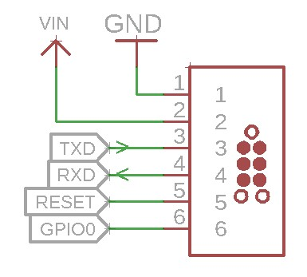

# ESProgrammer
A simple USB programming interface for ESP8266/ESP32

## Features
* Automatic Reset/GPIO0
* TagConnect interface for custom devices
* Direct connector for ESP-01 modules

# Pinout and TagConnect
**RX of Programmer to RX of ESP and TX to TX**
(Which is a bit confusing to be honest)

The TagConnect connector follows my own standard which I've created for my devices using an ESP8266.

The device should utilize this pinout:

Whereas TXD goes to the TXD of the ESP8266 and RXD goes to the RXD of the ESP.

# Jumper
## Automatic
The two "Automatic" jumpers allow for an automatic trigger of the Reset and GPIO0 line during programming like on NodeMCU boards and Tasmotizer.
Manual resetting and triggering GPIO0 will always be possible with the push buttons.

## 3V3/5V
The other jumper near the TagConnect allows for a selection of the power supply voltage of the TagConnect. When my device has an LDO and 5V power supply, VCC will be set to 5V and the VCC pin on the device goes to the 5V input of the board.